```{r setup, include=FALSE}
knitr::opts_chunk$set(echo = FALSE)
```

## Outline

- Introduction
- Model selection procedures
- Simulations and results

# Introduction

## Survival extrapolation

<!-- - In the cost-effectiveness analysis of health technology assessment, conducting a scientifically sound survival extrapolation is a complex process
- Fitting several models and selecting plausible models are indispensable parts -->

- Long-term extrapolations from parametric survival models for time-to-event outcomes are used to provide inputs for cost-effectiveness analysis of health technology assessment (HTA)

- Conducting a scientifically sound survival extrapolation is a complex process that involves fitting multiple models and selecting plausible ones

- This need for survival extrapolation and model selection also extends beyond HTA, e.g. event projection during Phase III studies 

- Typically, several parametric models for time-to-event outcomes are required to be fitted for a dataset (NICE TSD 14)

<div align="center">
<span style='color: teal;'>How do we select the best model?</span>


## Parametric models

<div align="center">
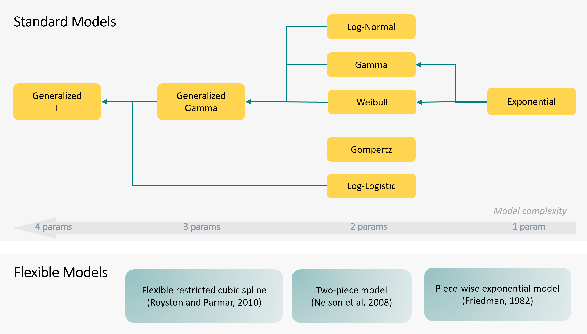{ width=90% }

## Drawbacks of commonly used parametric model selection techniques
Visual assessment of fitted curve vs Kaplan-Meier curve

- Is subjective
- Does not quantitatively account for inflated uncertainty in the tail of the KM curve (due to smaller risk sets)
- Is unreliable when available survival data is immature (not uncommon at the initial stage of HTA application)

Ranking based on goodness-of-fit measures (AIC/BIC)

- Seeks the best model which is not necessary in all cases
- Overlooks estimation uncertainty (e.g. small differences among top performers might not be statistically nor practically meaningful)


## Test-based model selection to improve on AIC/BIC

- A test-based model selection procedure can be an alternative approach to ranking of goodness-of-fit measures, aiming to achieve a better balance between model fit and parsimony, while accounting for sample uncertainty
- Key challenge: most pairs of parametric models are non-nested (NICE TSD 14), thus the conventional likelihood ratio test procedure is inapplicable


## Nested models

- Example of nested models: Exponential($\lambda$) and Gamma($\alpha,\beta$)
- For nested models we can use the Likelihood Ratio (LR) test
- -2*log-LR is asymptotically chi-square distributed under the null, with degrees of freedom equal to the dimension reduction in the parameter space [@wasserman2013all]
- Such property is not preserved when the hypotheses are non-nested [@vuong1989likelihood] 

<div align="center">
<span style='color: teal;'>Test statistic and procedure for non-nested hypotheses?</span>

## Non-nested models

- Two models are defined to be non-nested if it is not possible to derive one model from the other model either by means of an exact set of parametric restrictions or as a result of a limiting process. (A more precise definition involves Kullback-Leibler Information Criteria, @granger2000decision)
- Example of non-nested models: Gamma and Weibull
- Prior research has suggested to construct the empirical distribution function of the test statistic by resampling the likelihood ratio using a parametric bootstrapping procedure [@chen2023on]


## Goals of this project

- Find a more efficient bootstrapping procedure:
  - If we use a pivotal statistic instead of the LR, we can improve on computational efficiency
  - A statistic is pivotal if it does not depend on unknown parameters, e.g. the t-statistic defined in terms of the sample mean 
- Evaluate the impact of different methods to generate bootstrapped datasets and the impact of non-informative censoring on the procedure
- Compare the test-based model selection procedure to the AIC/BIC ranking


# Model selection procedures

## Problem setup
- Let $T_i$ be the survival time of an event of interest, and $C_i$ be the censoring time, for patient $i$.
- We observe only $Y_i=\min(T_i,C_i)$ and $\Delta_i=\mathbf{1}(T_i\le C_i)$, hence the dataset is $\mathcal{D}=\{(Y_i, \Delta_i)\}_{i=1}^n$ 
- Consider testing two non-nested models
$$H_f: \mathcal{M}_\theta = \left\{f(y|\theta), \theta\in\Theta\right\}$$
$$H_g: \mathcal{M}_\gamma = \left\{g(y|\gamma), \gamma\in\Gamma\right\}$$where $f(y|\theta)$ and $g(y|\gamma)$ are density functions with unknown parameter vectors $\theta\in\Theta$ and $\gamma\in\Gamma$, respectively
- Denote the log-likelihood difference by
$$\Delta_{fg}(\theta,\gamma|\mathcal{D}) = L_f(\theta|\mathcal{D}) - L_g(\gamma|\mathcal{D})$$

## The Cox's test statistic is pivotal

- The Cox's test statistic is defined as
$$T_{fg} = \frac{\Delta_{fg}(\hat\theta,\hat\gamma|\mathcal{D}) - \hat\mu(\hat\theta, \hat\gamma^*)}{\hat{v}(\hat\theta, \hat\gamma^*)}$$
where $\hat\mu(\hat\theta, \hat\gamma^*)$ and $\hat{v}(\hat\theta, \hat\gamma^*)$ are consistent estimators of the mean and variance of the log-likelihood difference under the null $H_f$ [@cox1961tests; @cox1962further]
- Under regularity conditions, the Cox's test statistic is asymptotically distributed as a $N(0,1)$ under the null $H_f$ [@white1998regularity]. Therefore, the Cox's statistic is asymptotically pivotal.
- The mean and variance adjustments often involves analytically intractable expectations, so use parametric bootstrap to calculate the mean and variance adjustments. In particular, two approaches [@kapetanios2003non]:
  - The estimated parameters are treated as fixed
  - The estimated parameters are allowed to vary across each bootstrap iteration

## Procedures

1. Bootstrap-based: generate $R$ samples from the fitted null model and compute the Cox's statistic for each sample. The p-value is
$$\frac{1}{R}\sum_{r=1}^R\mathbf{1}(T_{fg}^{(r)}\le T_{fg})$$

2. Normal approximation: we can compare the observed Cox's test statistic to the standard normal distribution. For a level $\alpha$ test, reject the null if $T_{fg}<z_{\alpha}$, where $z_\alpha$ is the $\alpha$-quantile of a $N(0,1)$.


# Simulations and results

<!--
## Scenarios

- True Gamma (uncensored)
- True Gamma (censored) ABCDE
- Simtrial Ex 4: represents early stage hazard (frc3 vs Gamma, frc3 vs Log-Logistic, frc3 vs frc2)
-->

## Simulation setting

- Generate uncensored times from Gamma(2,1)
- Sample size: n = 300
- Number of bootstrap samples: R = 1000; 500; 100
- Number of simulations: N = 10000

<div align="center">
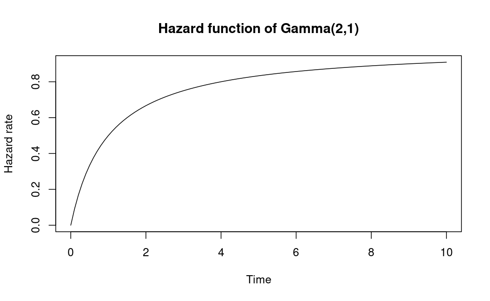{ width=70% }

</div>


<!--
<font size="2">

| Model        | DFs | AIC     | BIC     |
|--------------|-----|---------|---------|
| Exponential  | 1   | 1012.08 | 1015.78 |
| Gamma        | 2   | 958.82  | 966.23  |
| Weibull      | 2   | 960.93  | 968.34  |
| Log-Normal   | 2   | 994.74  | 1002.15 |
| Log-Logistic | 2   | 983.37  | 990.77  |
| Gompertz     | 2   | 984.58  | 991.98  |
| FRC spline 2 | 4   | 962.51  | 977.33  |
| FRC spline 3 | 5   | 964.27  | 982.79  |

</font>
-->


## Gamma vs Weibull

<div style="float: left; width: 50%;">

<div align="center">

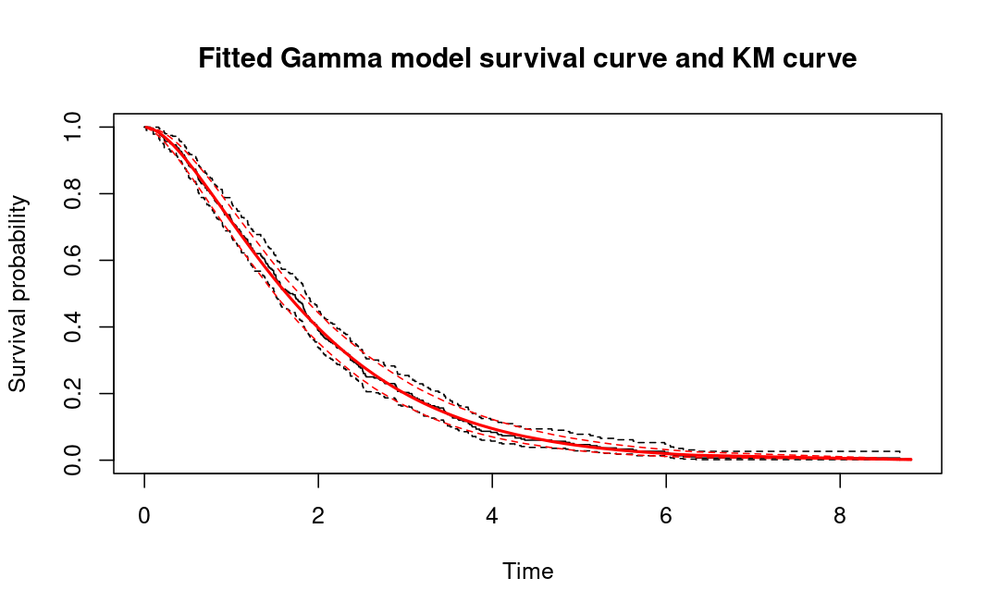

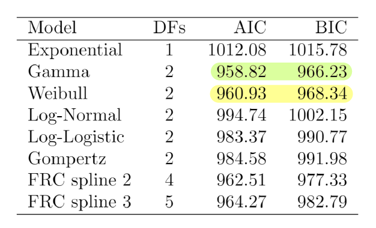

</div>
</div>


<div style="float: right; width: 50%;">
<div align="center">

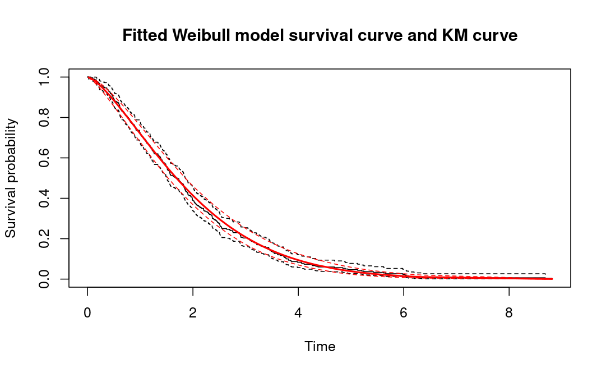

AIC relative difference = 0.22%

$$H_f: \mathcal{M}_\theta = \text{Gamma}(\theta)$$

$$H_g: \mathcal{M}_\eta = \text{Weibull}(\eta)$$

</div>
</div>


## Evaluation of type I error 

1. Type I error for the bootstrap-based procedures: let $p_i$ be the empirical p-value obtained in simulation $i$, for $i=1,\dots,N$. Then,
$$\frac{1}{N}\sum_{i=1}^{N} \mathbf{1}(p_i<\alpha)$$
2. Type I error for the normal approximation procedures: let $T_{i}$ be the observed Cox's statistic obtained in simulation $i$, for $i=1,\dots,N$. Then,
$$ \frac{1}{N}\sum_{i=1}^{N} \mathbf{1}(T_{i}<z_\alpha)$$

We use $\alpha=0.05$.

Monte Carlo standard error: $\sqrt{\frac{\text{err}(1-\text{err})}{N}}$


## Results

<div align="center">
| R    | LR bootstrap | Cox bootstrap | $N(0,1)$ approx  (fixed par) | $N(0,1)$ approx (varying par) |
|:----:|:------------:|:-------------:|:--------------------------:|:---------------------------:|
| 1000 | 0.0538       | 0.0515        | 0.0527                     | 0.0536                    |
| 500  | 0.0541       | 0.0522        | 0.0526                     | 0.0537                      |
| 100  | 0.0551       | 0.0516        | 0.0529                     | 0.0550                      |


<!--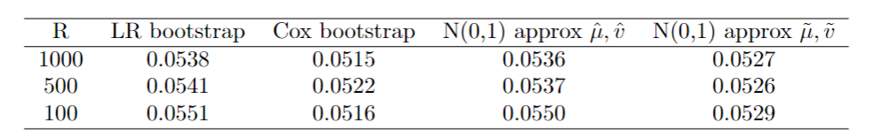{ width=60% } -->


Monte Carlo standard error <0.0023 

</div>


<div style="float: left; width: 50%;">

<div align="center">
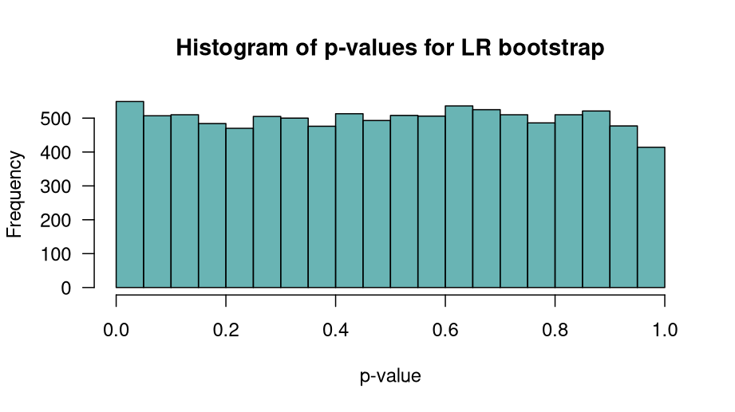{ width=100%, height=100% }

</div>
</div>

<div style="float: left; width: 50%;">

<div align="center">
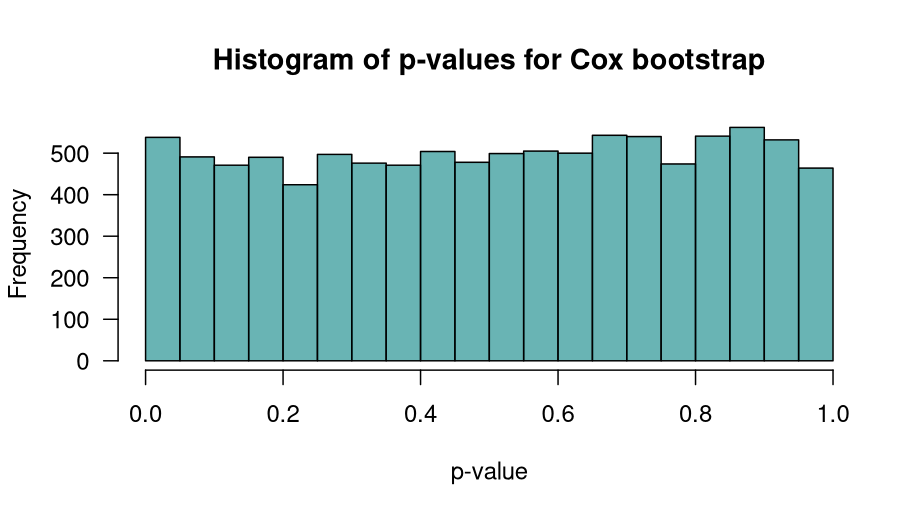{ width=100%, height=100% }

</div>
</div>


## Normality of test statistic

<div align="center">
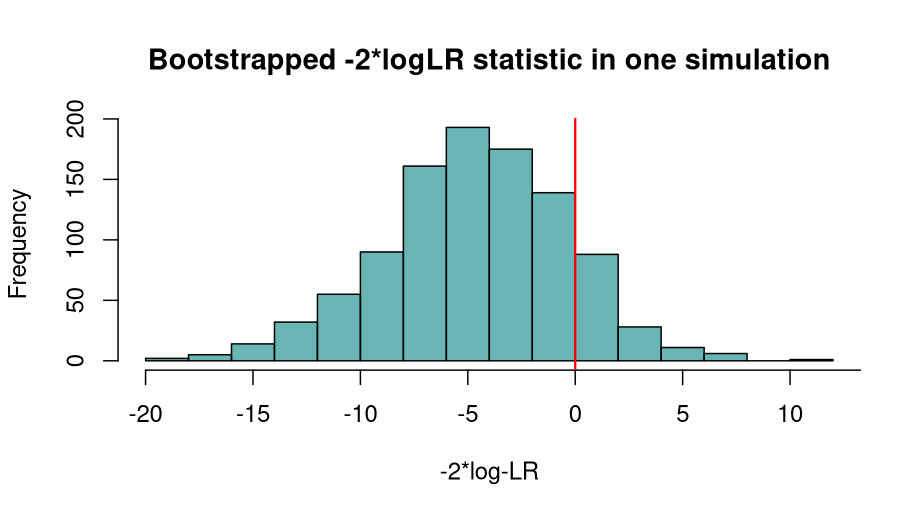{ width=50% }
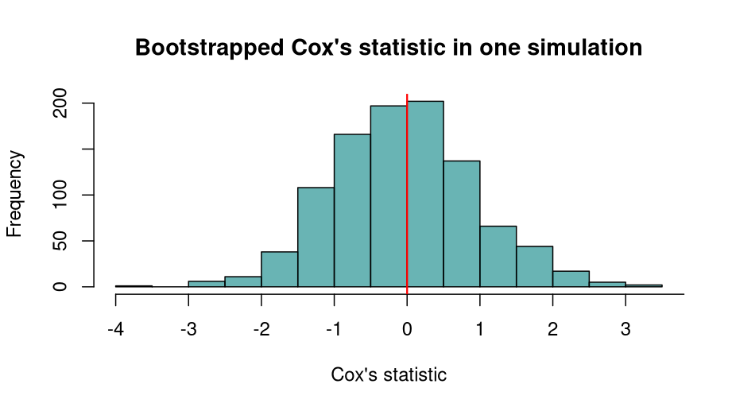{ width=50% }
</div>


## Other simulations and results

- Evaluate the impact of non-informative censoring on the procedure
  - We tried different strategies to account for censoring while generating the bootstrapped datasets
  - We find that non-informative censoring has a minimal impact on type I error, under different censoring proportions

- Evaluate the procedure for flexible models (flexible restricted cubic splines, @royston2002flexible)
  - Example: this hazard shape is common in oncology trials

<div align="center">
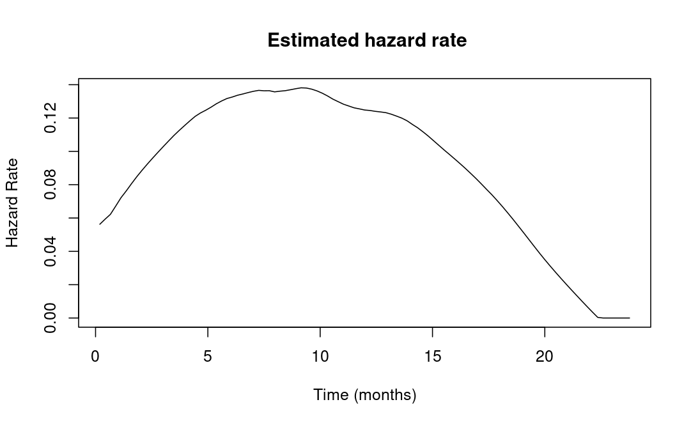{ width=50% }

<font size="3">Data from [simtrial](https://merck.github.io/simtrial/) R package [@lin2020alternative]</font>


## Ongoing work and future directions

- Evaluate statistical power
- Joint model for treatment and control arms
- Model including covariates
- Evaluate the impact of informative censoring on the procedure


# Thank you {.thank-you}

**Email:** rfarina@andrew.cmu.edu

## References
<div id="refs">
\printbibliography[heading=none]
\def\printbibliography{}
</div>


# Appendix

## NICE TSD 14

<div align="center">
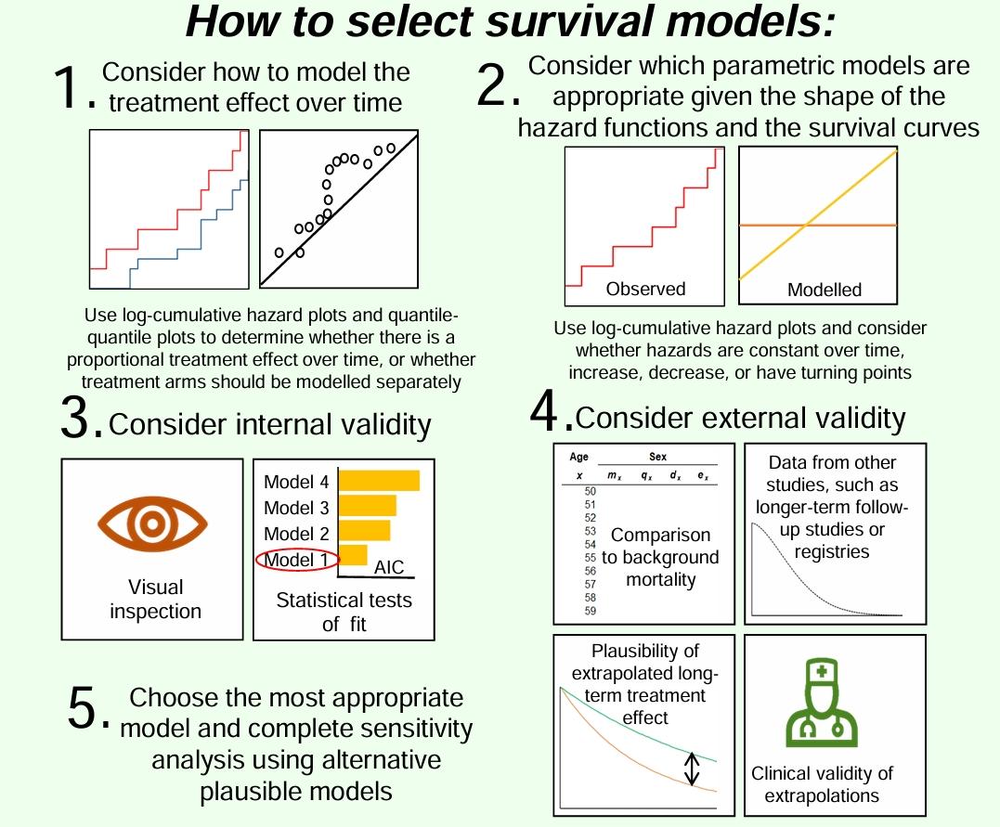{ width=75% }


## Notation
- Denote the respective log-likelihood functions of $f$ and $g$, given data $\mathcal{D}$, by $L_f(\theta|\mathcal{D})$ and $L_g(\gamma|\mathcal{D})$.
- Denote the maximum likelihood estimator of $\theta$ under $H_f$ by $\hat\theta$, and the maximum likelihood estimator of $\gamma$ under $H_g$ by $\hat\gamma$.
- Under the null $H_f$, let $\theta = \theta_0$ and let and $\gamma^*$ denote the pseudo-true value of $\gamma$ [@pesaran1993simulation, @pesaran2001non]
- Denote the log-likelihood difference by
$$\Delta_{fg}(\theta,\gamma|\mathcal{D}) = L_f(\theta|\mathcal{D}) - L_g(\gamma|\mathcal{D})$$

## LR test for nested and non-nested models
$H_0: \theta\in\Theta_0$ vs $H_1:\theta\notin\Theta_0$, where $\Theta_0\subset\Theta$

Since models are nested, $L(\theta_0|\mathcal{D}) \leq L(\theta|\mathcal{D})$, thus 

$$\lambda=-2(L(\theta_0|\mathcal{D}) - L(\theta|\mathcal{D}))\geq 0$$
Under $H_0$, $\lambda\sim\chi^2_k$ where $k=\text{dim}(\Theta)-\text{dim}(\Theta_0)$

$$ $$

For non-nested models, $L_f(\theta|\mathcal{D}) - L_g(\gamma|\mathcal{D})$ can be positive or negative. We want to reject $H_0$ when $L_f(\theta|\mathcal{D})<< L_g(\gamma|\mathcal{D})$


## More about the Cox's statistic
The Cox's test statistic is defined as
$$T_f(\hat \theta, \hat \gamma ) = \frac{\Delta_{fg}(\hat\theta,\hat\gamma|\mathcal{D}) - \hat\mu(\hat\theta, \hat\gamma^*)}{\hat{v}(\hat\theta, \hat\gamma^*)}$$
where $\hat\mu(\hat\theta, \hat\gamma^*)$ and $\hat{v}(\hat\theta, \hat\gamma^*)$ are consistent estimators of the mean and variance of the log-likelihood difference under the null $H_f$ [@cox1961tests; @cox1962further].

Drawbacks [@pesaran2001non; @kapetanios2003non]

- It requires a consistent estimator of the pseudo-true value $\gamma^*$
- It depends on the specific models we are testing
- The mean and variance adjustments often involves analytically intractable expectations


Possible solution: parametric bootstrap to calculate the mean and variance adjustments [@pesaran1993simulation]. Not much literature on this procedure in the context of parametric survival (flexible) models.

## Bootstrap-based procedure
<font size="4">

1. Compute the MLEs under null and alternative: $\hspace{0.5cm}\hat\theta=\text{argmax}_{\theta\in\Theta}L_f(\theta|\mathcal{D})$, $\hspace{0.5cm}\hat\gamma=\text{argmax}_{\gamma\in\Gamma}L_g(\gamma|\mathcal{D})$

2. Generate $R$ samples of size $n$ from the fitted null model $f(y, \hat\theta)$: $\hspace{0.5cm}\mathcal{D}^{(r)}=\{Y_i^{(r)}\}_{i=1}^n,\, r=1,\dots,R$

3. For each $r=1,\dots,R$, compute the MLEs: $\hspace{0.5cm}\hat\theta^{(r)}=\text{argmax}_{\theta\in\Theta}L_f(\theta|\mathcal{D}^{(r)})$, $\hspace{0.5cm}\hat\gamma^{(r)}=\text{argmax}_{\gamma\in\Gamma}L_g(\gamma|\mathcal{D}^{(r)})$

4. Compute the pseudo-true estimator: $\hspace{0.5cm}\hat\gamma^* = \frac{1}{R}\sum_{r=1}^R \hat\gamma^{(r)}$

5. Compute the mean and variance adjustments
$$\hat\mu = \frac{1}{R}\sum_{r=1}^R \Delta_{fg}(\hat\theta,\hat\gamma^*|\mathcal{D}^{(r)}) \hspace{1cm} \hat v = \frac{1}{R-1}\sum_{r=1}^R \left\{\Delta_{fg}(\hat\theta,\hat\gamma^*|\mathcal{D}^{(r)})  - \frac{1}{R}\sum_{s=1}^R \Delta_{fg}(\hat\theta,\hat\gamma^*|\mathcal{D}^{(s)}) \right\}^2$$
6. For each $r=1,\dots,R$, compute the Cox's statistic
$$T_{fg}^{(r)} =\frac{\Delta_{fg}(\hat\theta^{(r)},\hat\gamma^{(r)}|\mathcal{D}^{(r)})-\hat\mu}{\sqrt{\hat v}}$$

7. The p-value is $\frac{1}{R}\sum_{r=1}^R\mathbf{1}(T_{fg}^{(r)}\le T_{fg})$, where $T_{fg}$ is the observed Cox's statistic 

</font>

## Normal approximation
Compare the observed Cox's test statistic to the standard normal distribution: for a level $\alpha$ test, reject the null if 
$$T_{fg}=\frac{\Delta_{fg}(\hat\theta,\hat\gamma|\mathcal{D})-\hat\mu}{\sqrt{\hat v}}<z_{\alpha}$$
where $z_\alpha$ is the $\alpha$-quantile of a $N(0,1)$.

Two approaches to center the log-likelihood ratio [@kapetanios2003non] 
$$\hat\mu = \frac{1}{R}\sum_{r=1}^R \Delta_{fg}(\hat\theta,\hat\gamma^*|\mathcal{D}^{(r)})\hspace{1cm}\tilde\mu = \frac{1}{R}\sum_{r=1}^R \Delta_{fg}(\hat\theta^{(r)},\hat\gamma^{(r)}|\mathcal{D}^{(r)})$$ 


## Simulation setting for non-informative censoring

- Generate survival times $T_i$ from Gamma(2,1)
- Generate censoring times $C_i$ from Exp($\lambda$)
- We observe $Y_i=\min(T_i,C_i)$ and $\Delta_i=\mathbf{1}(T_i\le C_i)$

$$ $$ 

- Sample size: n = 300
- Number of bootstrap samples: R = 100
- Number of simulations: N = 10000
- Observed proportion of censoring:
  - 10%, Exp(0.05)
  - 30%, Exp(0.19)
  - 50%, Exp(0.41)

## How do we account for censoring in the bootstrap datasets?

Possible strategies

A. No adjustment (all bootstrap data are uncensored)

B. Censor if event occurs after the maximum time observed in the original data

C. The bootstrap sample size is set to be number of events observed in the original data, instead of n

D. Model the censoring mechanism via the exponential model (not possible in real cases where the the true model is unknown)

E. Model the censoring mechanism via Kaplan-Meier 


  
## Type I error results

<div align="center">
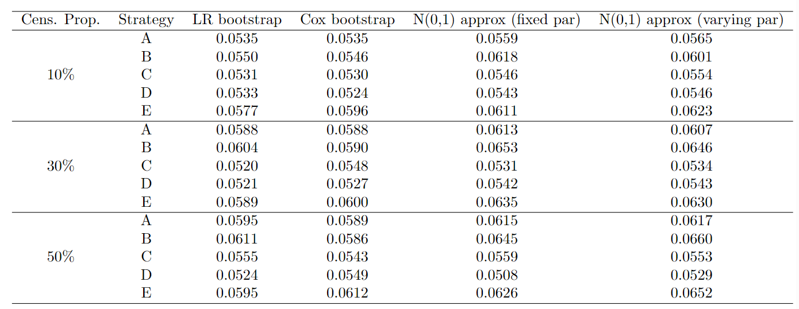{ width=80%, height=100% }

</div>


## Flexible models

- Data from [simtrial](https://merck.github.io/simtrial/) R package [@lin2020alternative]
- This hazard shape is commonly found in oncology trials
- n=387, #events=327

<div align="center">
{ width=65% }

Obtained via the [muhaz](https://cran.r-project.org/web/packages/muhaz/muhaz.pdf) R package, which uses kernel-based methods

</div>

## Flexible models

<div align="center">
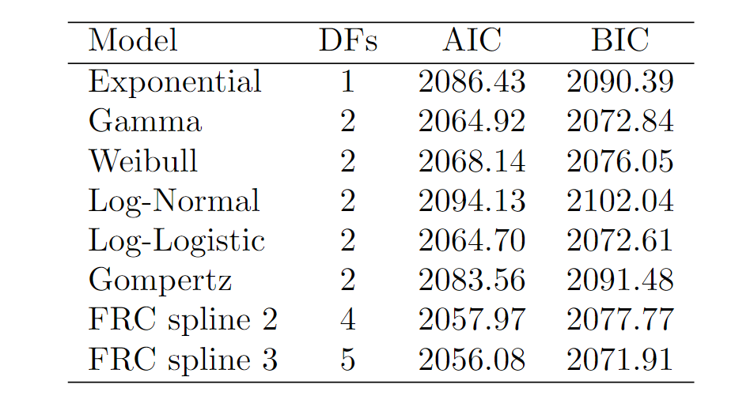{ width=65% }
</div>

We test: FRC spline 3 vs Gamma; Log-Logistic; FRC spline 2

These are censored data but we don’t know the censoring mechanism so we remain agnostic about it. We adopt strategy B when bootstrapping datasets from null model: censor if event occurs after the maximum time observed in the original data 


## p-value

| Alternative  | LR bootstrap | Cox bootstrap | N(0,1) approx (fixed par) | N(0,1) approx (varying par) |
|:------------:|:------------:|:-------------:|:-------------------------:|:---------------------------:|
| Gamma        | 0.210        | 0.136         | 0.282                     | 0.207                       |
| Log-Logistic | 0.346        | 0.245         | 0.397                     | 0.306                       |
| FRC spline 2 | 0.361        | 0.426         | 0.295                     | 0.322                       |

